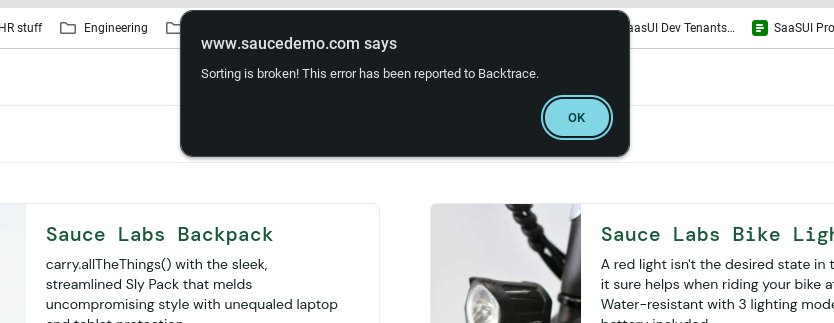
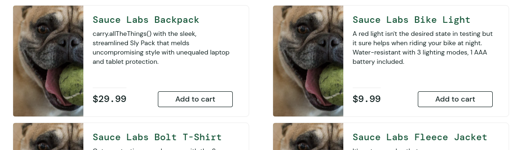
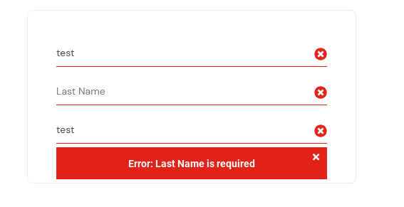

# Bug Report

## Overview

The format for each bug has been outlined in the Test Strategy section in Excercise-1.md

## B-01

**Title:**
Time lag on user at log in

**Description:**
When logging in as username 'performance_glitch_user' there is a few second delay before the logged in home page is reached

**Steps to reproduce**

1. Go to the Saucedemo login page at https://www.saucedemo.com/
2. Enter 'performance_glitch_user' in the username field
3. Enter 'secret_sauce' in the password field
4. Press the log in button

**Expected Result:**
User is logged into home page after approximately a second (dependent on connection)

**Actual Result:**
User is logged into home page after approximately 5 seconds

**Severity:**
Minor

**Priority:**
P3

### Attachments

## B-02

**Title:**
Filter button error with specific user

**Description:**
When trying to use filter for username 'error_user' the button displays an error on selection of any 

**Prerequisite:** 'error_user' must be logged in

**Steps to reproduce**

1. Select filter button in top right hand corner
2. Choose any option

**Expected Result:**
Product list should be filtered based on selected option

**Actual Result:**
Error message display about broken sorting

**Severity:**
Moderate

**Priority:**
P3

### Attachments

## B-03

**Title:**
Product list images incorrect on user

**Description:**
When logged in as 'problem_user' the product list displayed has all images as a dog instead of the correct product

**Prerequisite:** must be at login page

**Steps to reproduce**

1. Go to the Saucedemo login page at https://www.saucedemo.com/
2. Enter 'problem_user' in the username field
3. Enter 'secret_sauce' in the password field
4. Press the log in button

**Expected Result:**
Product list should have all correct images corresponding to their respective product

**Actual Result:**
Product list images all dogs

**Severity:**
Moderate

**Priority:**
P2

### Attachments

## B-04

**Title:**
Filter button not working with specific user

**Description:**
When trying to use filter for username 'problem_user' the button does not filter the products

**Prerequisite:** 'problem_user' must be logged in

**Steps to reproduce**

1. Select filter button in top right hand corner
2. Choose any option

**Expected Result:**
Product list should be filtered based on selected option

**Actual Result:**
Product list stays on previous filter

**Severity:**
Moderate

**Priority:**
P3

### Attachments

## B-05

**Title:**
Filter button lag

**Description:**
When trying to use filter for username 'performance_glitch_user' the products are filtered after a delayed period

**Prerequisite:** 'performance_glitch_user' must be logged in

**Steps to reproduce**

1. Select filter button in top right hand corner
2. Choose any option

**Expected Result:**
Product list should be filtered based on selected option in acceptable time

**Actual Result:**
Product list filterd after noticable delay

**Severity:**
Minor

**Priority:**
P3

### Attachments

## B-06

**Title:**
Cart shared across users

**Description:**
When adding items to cart and logging out to log in as a different user, the same cart still exists

**Prerequisite:** All users carts should be empty

**Steps to reproduce**

1. Log in as 'standard_user' (see Test Data Section)
2. Add items to cart
3. Log out
4. Log in as any viable user

**Expected Result:**
Cart should be empty

**Actual Result:**
Cart contains items from last logged in user

**Severity:**
Major

**Priority:**
P1

### Attachments

## B-07

**Title:**
Product Add disabled on certain users

**Description:**
When adding items to cart on certain users, some of the product add buttons are disabled

**Prerequisite:** Users cart should be empty

**Steps to reproduce**

1. Log in as 'problem_user' (see Test Data Section)
2. Add all items to cart on the first page

**Expected Result:**
Cart icon should have badge with the number 6 

**Actual Result:**
Some items were not added because some of the buttons are disabled

**Severity:**
Major

**Priority:**
P2

### Attachments

## B-08

**Title:**
Checkout details field disabled

**Description:**
When checking out as 'problem_user' last name field disabled and can't check out

**Prerequisite:** Must be logged in as 'problem_user'

**Steps to reproduce**

1. Add an item to cart
2. Click the cart icon in the top right corner
3. Click the continue button
4. Fill in the fields with relevant details

**Expected Result:**
Each field should be available to fill in

**Actual Result:**
Last name field is disabled

**Severity:**
Moderate

**Priority:**
P3

### Attachments

## B-09

**Title:**
Can make payment without last name field

**Description:**
When finishing payment 'error_user' can complete checkout without entering last name field

**Prerequisite:** Must be logged in as 'error_user'

**Steps to reproduce**

1. Add an item to cart
2. Click the cart icon in the top right corner
3. Click the continue button
4. Fill in the details fields for the order
5. Click finish payment

**Expected Result:**
An error should appear to fill in last name

**Actual Result:**
Confirmation of order screen displayed

**Severity:**
Minor

**Priority:**
P4

### Attachments