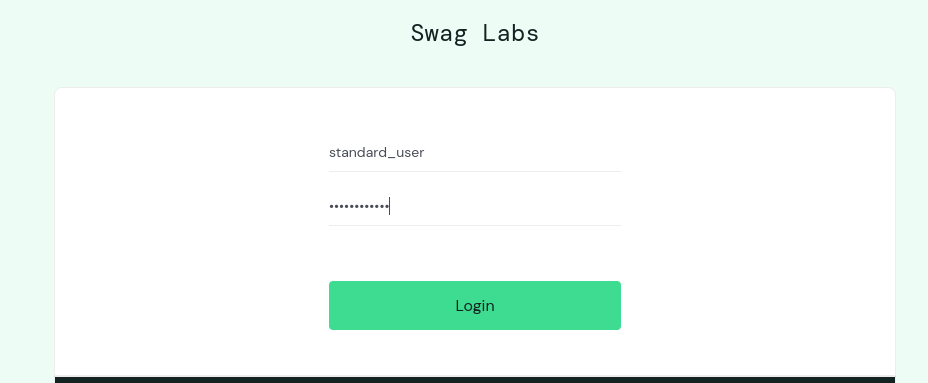
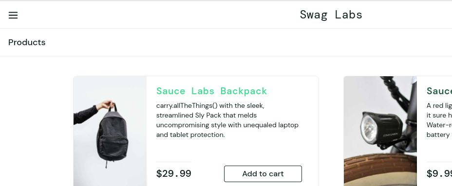
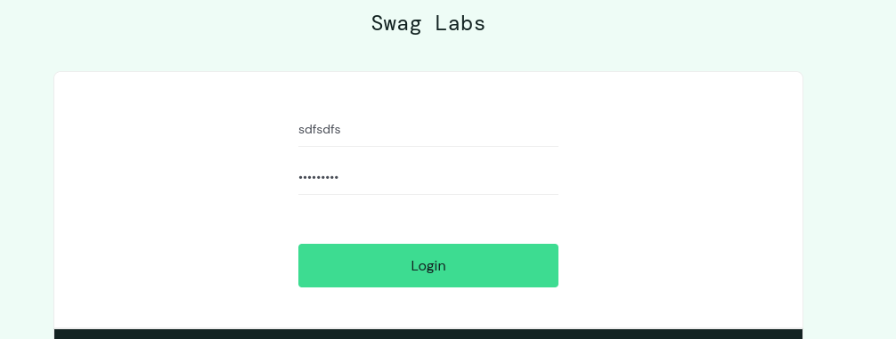
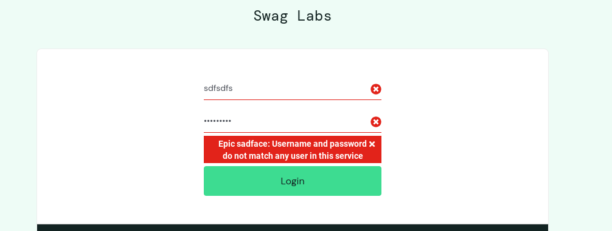
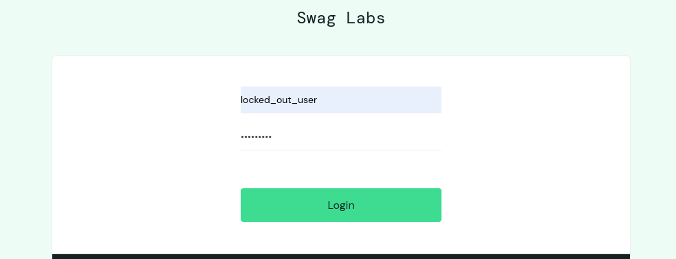
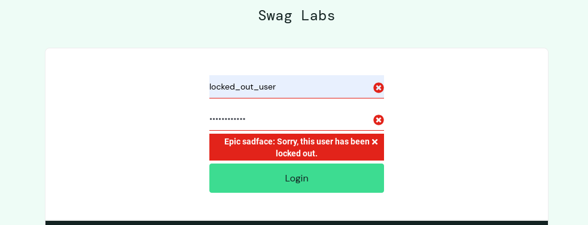
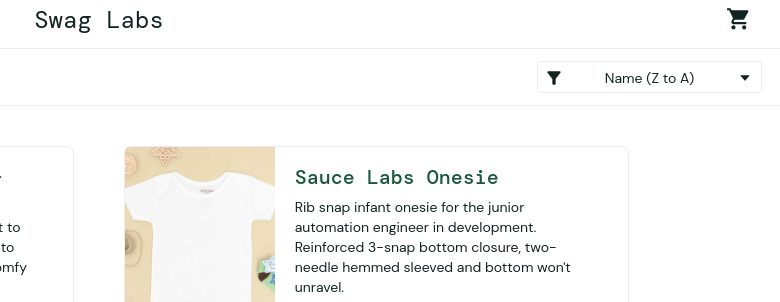
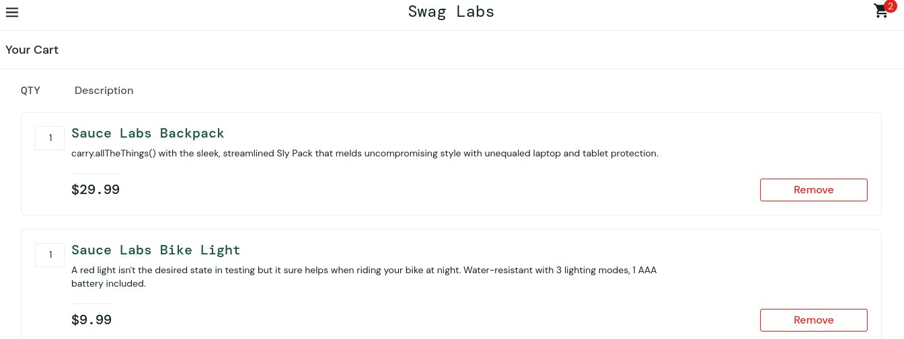
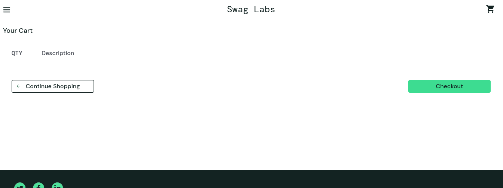
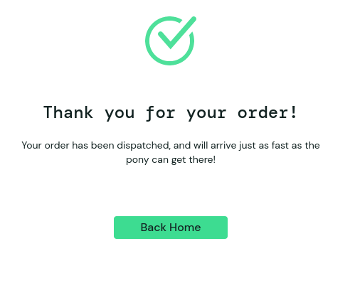

# Test Strategy

## Overview

### SauceDemo website

Is a commerce website that allows user to purchase items in a cart to be paid for via a payment card

### Purpose

This document outlines the test strategy for ensuring the quality and stability of the SauceDemo user interface. The primary objective is to verify that core functionalities work as expected on the chosen browser providing a smooth and reliable experience for end-users.

## Scope

The set of features that will be included for testing will be:
- Log in
- Product search
- Filtering
- Cart
- Checkout

#### Note

For the purpose of this projects since access is limited to the UI any backend features will be out of scope for this project

#### Browser

Testing will be carried out using Chrome

## Types of testing

#### Exploratory testing

A section of each test plan will be dedicated to exploring how that feature works on SauceDemo followed by a suite of tests per feature

 Other testing to be included in this project:

- Functional testing
    - Integration testing
    
        Testing whole features comes under this type of testing
    - Note (unit testing)

        Unit testing will be out of scope for this project with no access to the codebase
        
- End to end testing

    Testing here will include from logging in to finishing a purchase of items in the cart on SauceDemo

## Tools and Frameworks

**Framework** 

Pytest with selenium will be used for its ease of use to make requests to SauceDemo and can structure the test libraries in a clear and concise manner

**Driver**: ChromeDriver

**Test Reporting**: Pytest HTML report

**CI/CD Integration**: Docker with Jenkins

## Test Execution 

**CI-Based Execution**

The integration tests will be run from a jenkins pipeline running from a local docker container. Please see README.md to run this on your own machine

###  Test Prioritization 

**Overview**
Test prioritization is important when seprating critical tests from more minor to moderate tests that may not need to be included in critical CI pipelines. Such tests may be more suitable as regression tests or to be included in nightly builds.

**Rating**

Tests can be prioritized on the following scale:

**P1:** Always included in the CI/CD pipeline for fast feedback and quick detection of major issues.

**P2:** Run in extended test pipelines that will catch significant issues that may not be urgent 

**P3:** Omitted from regular CI/CD runs but included in full regression suites executed on a scheduled basis or before major releases.

### Bug Reporting

Any bugs found during the testing process will be documented in [BUGREPORT-1.md](/BUGREPORT-1.md) in the following format:

 - Bug ID
 - Title
 - Description
 - Steps to reproduce
 - Expected Result
 - Actual Result
 - Severity
 - Priority
 - Attachments

# Test Plans

## Log in

### Overview

The objective here is to verify the core functionality of the log in mechanism and documenting any bugs found in the process

### Test Scope

Tests that will be in scope will be predictable tests like testing with valid/invalid/empty credentials as well as time to log in

Tests that will be out of scope will include any load testing with the login mechanism to keep in line with functional verification primarily

### Test types

- Functional
- Negative
- Exploratory 

### Exploratory Testing Findings
 During testing, it was discovered that the system implements a user lockout mechanism, restricting access from logging in. This was added as a test case (TC-03) as a result

### Test Cases

**Index**

1. [TC-01-Verify successful login with valid credentials](#tc-01)
2. [TC-02-Verify invalid login with invalid credentials](#tc-02)
3. [TC-03-Verify locked user](#tc-03)
4. [TC-04-Verify product filtering](#tc-04)
5. [TC-05-Add cart products](#tc-05)
6. [TC-06-Remove cart products](#tc-06)
7. [TC-07-Verify successful checkout](#tc-07)
8. [TC-08-Verify cancel checkout](#tc-08)
9. [TC-09-Verify cancel payment](#tc-09)
10. [Verify product description](#tc-10)

**Test Case ID:** TC-01

**Title**: Verify successful login with valid credentials

**Priority:** P1

**Objective:** Ensure users can log in with valid username and password

**Preconditions:** User had valid account, user on login page

**Steps:**

1. Enter valid username (Refer to Test Data Section)
2. Enter valid password (Refer to Test Data Section)
3. Click login

**Expected Result:**

User redirected to site homepage without delay

**Test Case ID:** TC-02

**Title**: Verify invalid login with invalid credentials

**Priority:** P1

**Objective:** Ensure users can't log in with invalid username and password

**Preconditions:** User on login page

**Steps:**

1. Enter invalid username
2. Enter invalid password
3. Click login

**Expected Result:**

User gets invalid login error

**Test Case ID:** TC-03

**Title**: Verify locked user

**Priority:** P2

**Objective:** Verify a user can't log in if they're a locked user

**Preconditions:** User has account that is locked account, User on login page

**Steps:**

1. Enter valid username (Refer to Test Data section)
2. Enter valid password (Refer to Test Data section)
3. Click login

**Expected Result:**

User gets locked out error

## Filtering

### Overview

The objective here is to verify the core functionality of the filtering mechanism and documenting any bugs found in the process

### Test Scope

Tests that will be in scope will involve checking output of different filtering options

Tests that will be out of scope will include any load testing with the filtering mechanism to keep in line with functional verification primarily

### Test types

- Functional
- Exploratory 

### Exploratory Testing Findings
 During testing, it was discovered that certain users disable or cause an error when using the filtering button, these were added as bugs to BUGREPORT-1.md

### Test Cases

**Test Case ID:** TC-04

**Title:** Verify product filtering

**Priority:** P3

**Objective:** Verify a user can filter the product list based on the aphabetical order or price

**Precondition:** User must be logged in at the homepage

**Steps**

1. Click the filter button in the top right hand corner of the screen
2. Click through each of the filter options

**Expected Result:**

Product list is filtered based upon filter selected

## Cart

### Overview

The objective here is to verify the core functionality of the cart mechanism while documenting any bugs found in the process

### Test Scope

Tests that will be in scope will involve checking button functionality that adds/removes products to/from the cart

Tests that will be out of scope will include any load testing with the cart mechanism to keep in line with functional verification primarily

### Test types

- Functional
- Exploratory 

### Exploratory Testing Findings
 During testing, it was discovered that certain users cause some of the products listing buttons to become disabled.

A major bug was discovered whereby the cart data
is shared among users 

These were added as bugs to BUGREPORT-1.md

### Test Cases

**Test Case ID:** TC-05

**Title:** Add cart products

**Priority:** P1

**Objective:** Verify a user can add products to cart

**Precondition:** User must be logged in at the homepage (See Test Data section)

**Steps**

1. Add a few products to the shopping cart
2. Click cart icon in the corner

**Expected Result:**

Shopping cart icon should display a number that increments for each item added. Cart should show all items added.

**Test Case ID:** TC-06

**Title:** Remove cart products

**Priority: P1**

**Objective:** Verify a user can remove products from cart

**Precondition:** User must be logged in at the homepage (See Test Data section)

**Steps**

1. Add a few products to the shopping cart
2. Click cart icon in the corner
3. Click each remove button beside each item

**Expected Result:**

Shopping cart should be empty

## Checkout

### Overview

The objective here is to verify the core functionality of the checkout mechanism noting any bugs as we test

### Test Scope

Tests that will be in scope will involve checking button and field functionality that finishes checkout with payment, cancelling from checkout and error response for invalid fields

Tests that will be out of scope will include any load testing with the checkout mechanism to keep in line with functional verification primarily

### Test types

- Functional
- Negative
- Exploratory 

### Exploratory Testing Findings
 During testing, it was discovered that certain users when checking out cause fields to be disabled when inputting shipping information which locks the user out of paying. This was added as a bug to BUGREPORT-1.md

### Test Cases

**Test Case ID:** TC-07

**Title:** Verify successful checkout

**Priority:** P1

**Objective:** Verify a user can checkout items in cart

**Precondition:** User must be logged in at the homepage (See Test Data section), Have items in their cart

**Steps**

1. Click the checkout button
2. Fill in all fields with relevant details
3. Click the continue button
4. Ensure correct items are order details
5. Click finish button

**Expected Result:**

A confirmation message should be displayed about your order

**Test Case ID:** TC-08

**Title:** Verify cancel checkout

**Priority:** P1

**Objective:** Verify a user can cancel a checkout

**Precondition:** User must be logged in, must be in checkout screen

**Steps**

1. Click the 'Continue Shopping' button

**Expected Result:**

User should be brought back to the home page

**Test Case ID:** TC-09

**Title:** Verify cancel payment

**Priority:** P1

**Objective:** Verify a user can cancel a payment

**Precondition:** User must be logged in, must be in payment screen

**Steps**

1. Click the 'Cancel' button

**Expected Result:**

User should be brought back to the checkout screen

## Product View

### Overview

The objective here is to verify the core functionality of selecting a product for more details while logging bugs in the process

### Test Scope

The only test in scope will be to verify button functionality brings the user to the product view screen for more details

Tests that will be out of scope will include any load testing with the product view mechanism to keep in line with functional verification primarily

### Test types

- Functional
- Exploratory 

### Exploratory Testing Findings

 During testing, it was discovered that certain users on selecting certain products the details page shows error information. This was reported in BUGREPORT-1.md

### Test Cases

**Test Case ID:** TC-10

**Title:** Verify product description

**Priority:** P2

**Objective:** Verify a user can view more information on a product on selecting it

**Precondition:** User must be logged in at home screen

**Steps**

1. Click a product's title from the product listing

**Expected Result:**

User should be brought to the product listing's information screen

### Test Data

Use required login data dependent on what test case being carried out

**Valid Login - (TC-01, TC-04, TC-05, TC-06)**

Username: standard_user

Password: secret_sauce

**Locked Login - TC-03**

Username: locked_out_user

Password: secret_sauce

# Decisions and Reasons

## Pytest

One way I could have improved the test setups in each file was extracting the login part of each fixture from each of the classes and have it as a base fixture in a conftest.py file. Login was common to all feature tests therefore didn't need to be repeated

## Login

### Timed Logins
I included a test case to check swift login time that would fail if using 'performance_glitch_user'. With respect to only having the pipeline validating core functionality there's an argument to exclude this test as it only concerns one user making it of less priority than the others. 

### Priority ratings

Testing for valid/invalid/locked users would be classified as important business functionality 
that are definitely required on regular pipeline builds

## Filtering

I added testing for login in an acceptable time that is clearly a problem with filtering too. I ommitted the test to filter in an acceptable time taking the initial bug as a means to solve the general issue with performance on that user

### Priority ratings

I've rated the test for filtering functionality as a P3 as regardless of this feature working or not, general site functionality will operate the same way making this test more relevant to regression tests for a bug fix concering this feature outside of pipelines. I've included it in the automation tests to demonstrate some testing of the feature but acknowledge this point. 

## Cart

For the test to add items to a cart I thought about just adding all items on display to the cart since there are only 6. If thousands more were added to the capacity similar to amazon this test would take way too long even cause errors. As a result I only tested individual button functionality.

I reported a majoy bug in that the cart is shared across all users. In reality this would be a halt release until fixed major level bug but it may be expected behaviour in the context of this test site for ease of use

I also reported a bug in that some product buttons didn't work when adding products to cart. This is a major bug but I have it P2 because although a company would technically be losing money if these items couldn't be bought, general userflow function is not completely disrupted

### Priority ratings

All test cases here rated as P1. Without the ability to add or remove items from cart would completely negate user's functionality, and lowering sales for the business. These tests should definitely be included in regular CI pipelines

## Checkout

Pressing the cancel button at either phase of checking out whether at the continue screen or payment screen cancels checkout but keeps the products in cart. It's debatable whether the items should be removed from cart also and this could be cited as a bug. I omitted it from the context of the site question only being a testing means.

### Priority ratings

All test cases here rated as P1. The user having the ability to finalise what they're actually paying for is crucial for the user experience as well as low customer churn. This functionality should definitely be included in regular CI builds

## Product view

For the sake of the excercise and time limits, I've only added 4 features to the automation pipeline. In this instance product view functionality would be an important test case to include in regular builds, hence why I've only explored test case layout and bugs for this feature.

### Priority ratings

This test case would be rated as a P1. Harming the user experience by negating the user's ability to view more details on the product could hinder their decision to actually purchase the product which affects the companies profits. Tests for this functionality should definitely be included in the CI pipeline